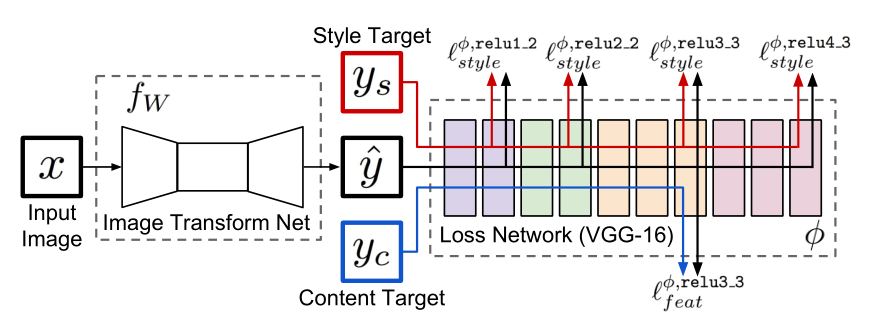
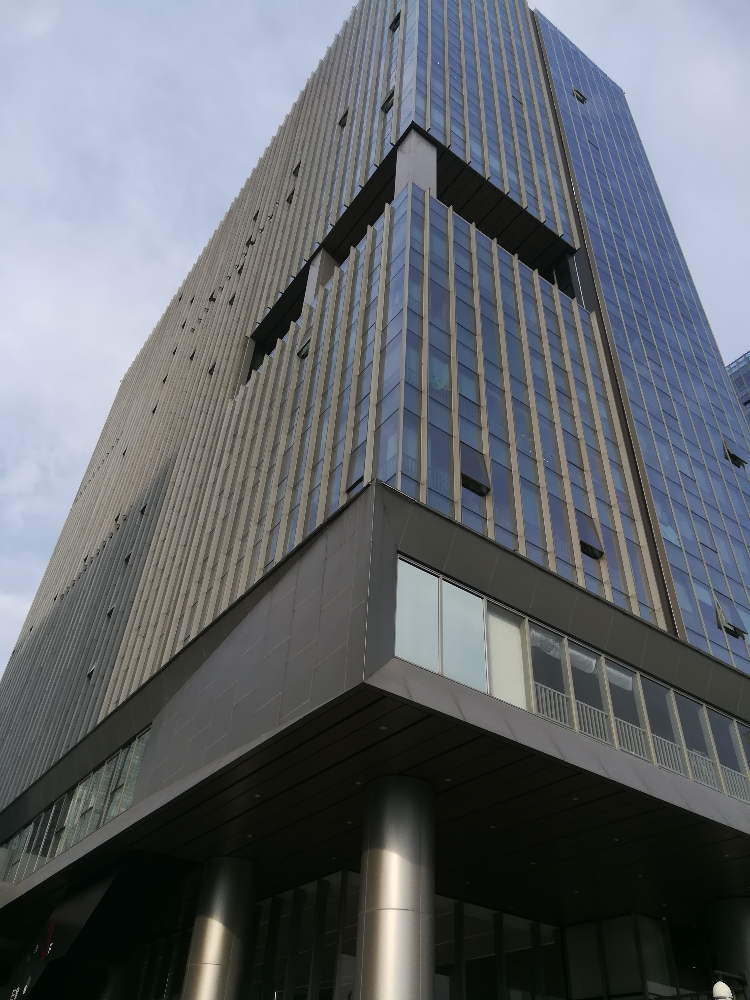
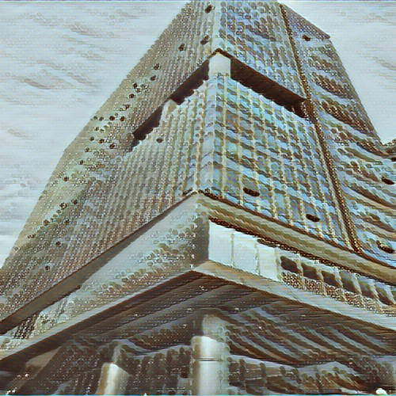
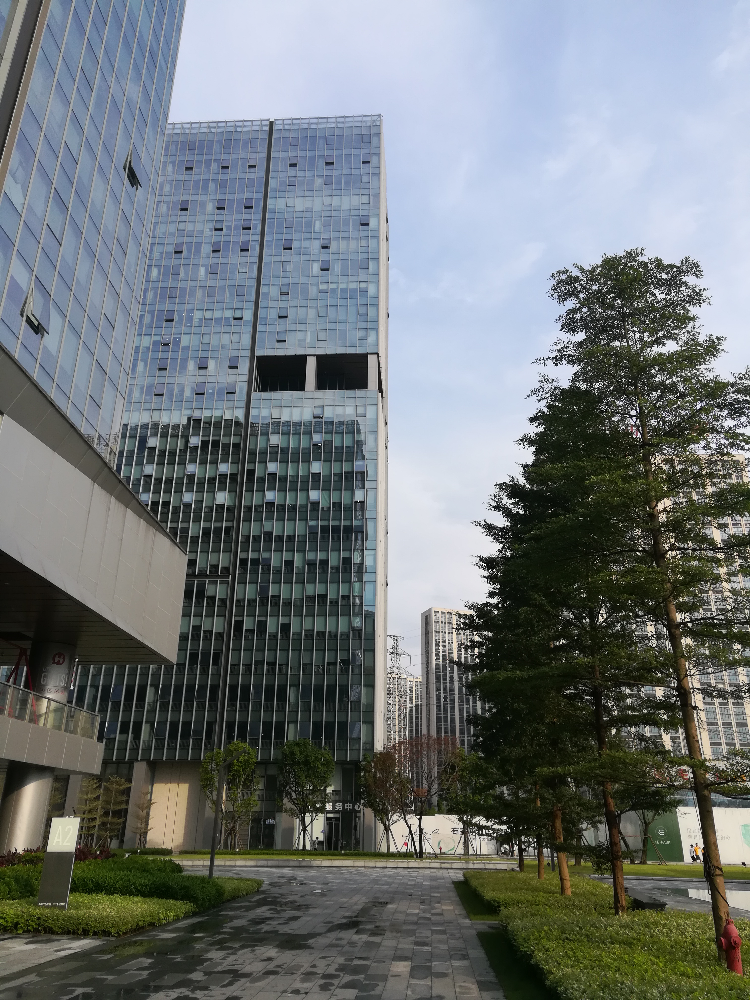
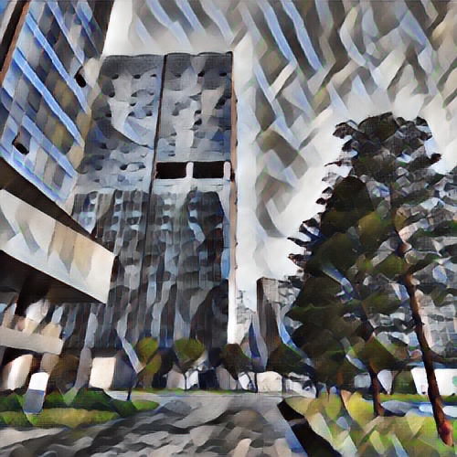
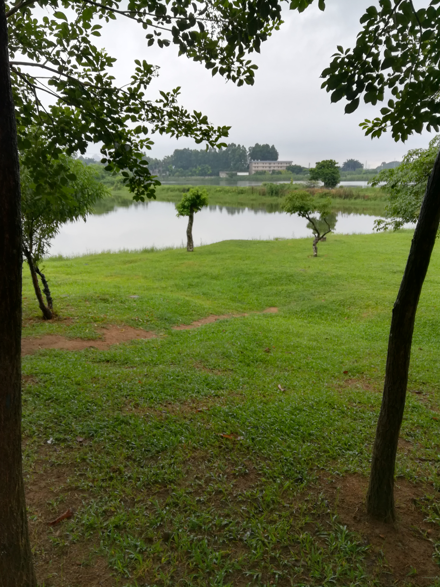
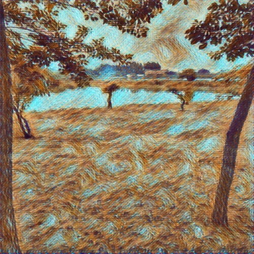
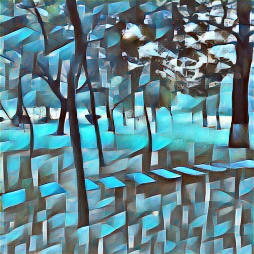

# 基于VGG-16模型的图像风格快速迁移

### 主要环境依赖：
Python 3.7.0 
TensorFlow 1.12.0 

### 模型架构：

    

图像风格快速迁移的理念在于，不再“推理时训练”，即不对风格化图像进行优化，而是设计并训练一个生成网络，使该网络达到风格化输出的效果。
整体模型又两块网络组成，左侧为图像生成网络，右侧为损失网络。损失网络为预训练的VGG-16模型，其中的中间层 relu3_3  负责对生成图像/内容图像提取内容特征，以及中间层 relu1_2,relu2_2,relu3_3,relu4_3 对生成图像/艺术图像提取风格特，然后分别构造内容损失函数和风格损失函数。

### 数据集训练：
训练所用为：[ Microsoft COCO dataset](http://msvocds.blob.core.windows.net/coco2014/train2014.zip)  
共82783张图片，以batch size为4，进行40000次迭代，每张图片大概会被学习两次即可。

### 模型存储
各epoch 的 模型文件保存于  model 目录中

### 风格化效果:

    
      
    
      
    
      
    
     

#### References:
[Perceptual Losses for Real-Time Style Transfer and Super-Resolution](https://arxiv.org/pdf/1603.08155.pdf)

